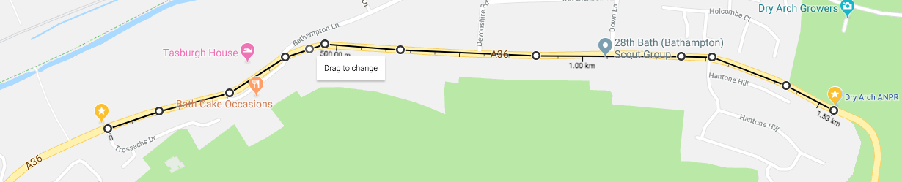

This is a quick look at the BANES/BathHacked data to assess speeds on the Warminster Road section, between the two ANPRs, one at Dry Arch on the entry to Bathampton, and the other on Warminster Rd. This is a distance of 1.53km along the road, according to the site positions published by BANES & BathHacked, and Google Maps.




First some basic initialisation. 

```{r initialise}
library(dplyr)
library(tidyr)
library(ggplot2)
library(readxl)
library(lubridate)
library(purrr)

source("BHTransits_f.R")

a_sep_km <- 1.53
a_sep_M <- a_sep_km * 0.621371192
```

We need to load the data and look for sequences which are westbound (ids 10 then 30), or eastbound (ids 29 then 9).

```{r}
#get some observations
obs <- readANPRObs(numobs = 4e5) %>%
  #only identified vehicles
  filter(vehicle_id != "") %>% 
  #sequences
  group_by(vehicle_id) %>% 
  arrange(time) %>% 
  #pick out pairs
  mutate(warm = case_when(
    (site_id == 30) & (lag(site_id) == 10) ~ "W",
    (site_id == 10) & (lead(site_id) == 30) ~ "W",
    (site_id == 9) & (lag(site_id) == 29) ~ "E",
    (site_id == 29) & (lead(site_id) == 9) ~ "E",
    TRUE ~ "U") ) %>% 
  #calculate speeds
  filter(warm != "U") %>% 
  #get times, only for valid starts of pairs
  mutate(ttime_hrs = if_else(site_id %in% c(10,29), (lead(time) - time)/3600, NA_real_)) %>% 
  #filter
  filter(site_id %in% c(10,29)) %>% 
  mutate(
    mph = a_sep_M/as.numeric(ttime_hrs),
    #create a time bin
    tbin = lubridate::round_date(time, "2 hours")) 


  
```

Now we can try some visualisations of the data. Boxplots are easier for statisticians than others, maybe, to read. 

```{r boxplots}

ggplot(obs, aes(time, mph, group = tbin)) + geom_boxplot() +
  facet_wrap(~warm) +
  labs(x = "Time", y="Speed (mph)")

```

```{r}
library(yarrr) #for pirate plot
#plot of speed
pp <- pirateplot(formula = mph ~ tbin ,
    data = obs,
    avg.line.fun = median,
    ylab = 'Average Speed (mph)',
    xlab = "Direction",
    inf.method = 'iqr',
    theme = 2,
    point.o = 0.2
    ) 
```

