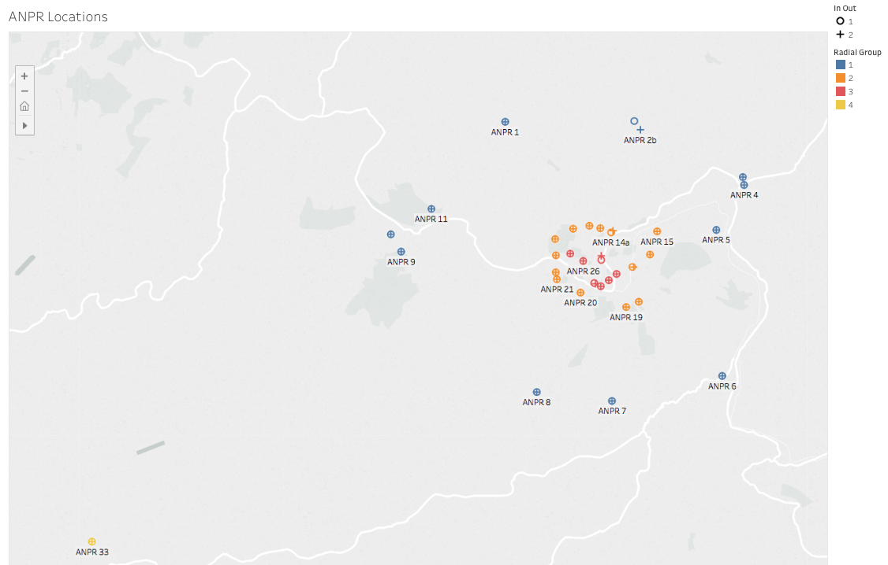

## Introduction

This project explores data made available by [BathHacked and BANES Council](https://www.bathhacked.org) about traffic around Bath. The data are from automatic number plate readers (ANPRs). BathHacked have used the data to explore vehicle emissions in and around the city.

My initial interest is the traffic entering the city along the Warminster Road.

```{r initialise, warning=FALSE}
library(dplyr)
library(tidyr)
library(ggplot2)
library(readxl)
library(lubridate)
library(circlize)
library(purrr)

library(networkD3)

source("BHTransits_f.R")
```


# Bath Transits

## Initial Data

I've plotted the locations of the data using a Tableau workbook.



The ANPRs consist of one in the far south-west (radial 4), an outer circle (radial 1) and inner circle (radial 2) and ANPRs near car parks (radial 3). Because of the focus on transiting traffic, I'm most interested in radial 1. I will group these into 5 clusters, as shown on the map: North (by-pass at Swainswick heading to and from the M4), Lansdown; East (Box Road to Chippenham, and Bathford); South (Brassnocker Hill, and 2 others); and West, towards Bristol.

```{r load data}
anpr <- read.csv("Data/banes_anpr_data/sites.csv", stringsAsFactors = F) %>% 
  mutate(group1 = case_when(
    location_id %in% c(1,2) ~ "North",
    location_id %in% c(3,4) ~ "East",
    location_id == 5 ~ "Bathampton",
    location_id %in% c(6,7,8) ~ "South",
    location_id %in% c(9,10,11) ~ "West"
                            ))

r1 <- anpr %>% filter(radial_group == 1)
r1_in <- r1 %>% filter(in_out == 1)
r1_out <- r1 %>% filter(in_out == 2)
  
obs <- read.csv("Data/banes_anpr_data/observations.csv", stringsAsFactors = F,
                nrows = 700000) %>% 
  #convert times, but ignore fractions of second 
  mutate(time = as.POSIXct(t, "%Y-%m-%d %H:%M:%S", tz="Europe/London")) %>% 
  select(-t) %>% 
  filter(time < as.POSIXct("2017-11-02 00:00:00.0", "%Y-%m-%d %H:%M:%S", tz="Europe/London"))
```

##Transits only

We focus on those vehicles that are identified, and which transit the city in the sense of being observed to pass in through radial 1 and then out again within a time limit.

```{r possible city transits}


#track carefully what data we are able to use
n_full <- nrow(obs) #number of observations
obsv <- obs %>% filter(vehicle_id != "")
n_vid <- nrow(obsv) #observations with a vehicle ID
vid_n <- obsv %>%
  count(vehicle_id) 

#plot the number of observations per vehicle
ggplot(vid_n, aes(x = n)) + geom_bar() +
  xlab("Number of times vehicle is seen at any ANPR") +
  ylab("Number of vehicles")

#observations at radial 1 per vehicle
obs1 <- obsv %>% 
  filter(site_id %in% r1$id)
vid1_n <- obs1 %>% count(vehicle_id) #number of observations on radial 1
vid1_2P <- vid1_n %>% filter(n >= 2) #filtered to 2 or more

#limit analysis to at least two crossings of radial 1
obs1 <- obs1 %>% filter(vehicle_id %in% vid1_2P$vehicle_id) %>%  
  #now with this smaller set
  #create a time bin
  mutate(tbin = lubridate::round_date(time, "30 mins")) %>% 
  #add in the groupings
  left_join(r1 %>% select(id, description, in_out, group1),
            by = c("site_id"="id"))

#not the most interesting of plots, because of the condition that it involves at least 2 rad1 crossings  
ggplot(obs1, aes(x=tbin)) + geom_bar() +
  facet_grid(group1 ~ in_out) +
  labs(x = "Time", y="Vehicle Count")
```

The graph shows that in our sample of `r n_full` ANPR observations, we have `r n_vid` with a vehicle ID, so that we can track. Of these vehicles, `r nrow(vid_n %>% filter(n ==1))` are only seen once, so there is no chance of a transit. Looking only at those crossing radial 1, we have `r nrow(vid1_n)` distinct vehicles crossing this radial, of which `r nrow(vid1_n %>% filter(n>1))` cross radial 1 more than once so could be transits.

We look through the ins and outs for each vehicle, and label the individual transits: over several days vehicles may make a few - some vehicles make more than 10 per day (buses?). We filter down to valid transits, a pair starting with and in and ending with an out, and lasting less than a certain number of minutes.

```{r get valid transits}

# test_veh <- obs1 %>% 
#   sample_n(10000) %>% #first downsample
#   select(vehicle_id) %>% 
#   distinct %>% 
#   sample_n(1000) #main downsample

obs1t <- obs1 %>% 
  # filter(time < as.POSIXct("2017-11-01 00:00:00.0")) %>%  #sample: 31/10/17
  #test sample
  # filter(vehicle_id %in% test_veh$vehicle_id) %>% 
  #for each vehicle in turn
  group_by(vehicle_id) %>% 
  arrange(time) %>% 
  mutate(transitID = getTransitIDs(in_out)) %>% 
  #tidy the transit IDs
  drop_na() %>% #where first for the vehicle is a 2
  slice(1:2) #just the first 2 in any transit, to ignore extra 2s

#check for vehicle transits with entry, not exit
#or with time of transit too long
eneBase <- obs1t %>% 
  group_by(vehicle_id, transitID) %>% 
  select(vehicle_id, transitID, time) %>% 
  mutate(n = n(),
         ttime = (last(time) - first(time))/60) %>% 
  select(-time) %>% 
  distinct() 


```


### Basic Chord Diagram

Using these valid transits, we generate some chord plots using `circlize`.

```{r chord plot}


# layout(matrix(1:2, 1, 2))
z <- trChord(obs1t, eneBase, 30)
title("Transits of Bath within 30 Minutes")
# (z <- trChord(obs1t, eneBase, 60))
# title("Transits of Bath within 60 Minutes")

```

Stretching a transit to 60 minutes doesn't seem to make that much difference to the overall pattern.

Next would be to do a split of these transits by vehicle type, or to look at peak hours.

## Bathampton Traffic

To put the transit traffic of 1,500-2,000 per day in context, we look in more detail at the overall traffic passing through Bathampton at Dry Arch. We see about `r 458/8756*100`% of vehicles are not identified. Probably a larger proportion are missed or unidentified at some ANPR as they pass through Bath, though the probability is unlikely to be 5% independently at each, since location, cleanliness of number plate, or being a foreign vehicle will be shared reasons for not being recognised. 

```{r Bathampton unknown vehicles}
# Bathampton totals
bht <- obs %>% 
  # time sample
  filter(time < as.POSIXct("2017-11-01 00:00:00.0")) %>% 
  # just Bathampton observations
  filter(site_id %in% c(9, 10)) %>% 
  mutate(vehicle_id = if_else(vehicle_id=="", NA_character_, vehicle_id))

summary(bht)
bht %>% filter(is.na(vehicle_id)) %>% summarise(n())

```

For the vehicles that are identified by the ANPR, we can track them. We get the sequence of observations per vehicle, and start a new one each time we see '10' (heading into Bath at Dry Arch) and end one after each '9' (leaving Bath at Dry Arch).

```{r sequences}
 # Bathhampton if it contains either 9 or 10
isBH <- function(x){(9 %in% x)||(10 %in% x)}
#use these to log in and out
in1 <- anpr %>% 
  filter((radial_group == 1) & (in_out == 1)) %>% 
  select(id)
out1 <- anpr %>% 
  filter((radial_group == 1) & (in_out == 2)) %>% 
  select(id)

# visit ID is like transitID, but based on site_ide not in-out
getVisitIDs <- function(sseq){
  #sseq is a vector of site_ids
  # first visit with first site
  #start a new visit at each in, or
  # after each out, allowing that lag creates an NA at the start, so replace it with FALSE
  vid <- data.frame(site = sseq) %>% 
    mutate(rnum = 1:length(site),
           entry = ifelse((rnum == 1)|(site %in% in1$id)|(na.omit(lag(site) %in% out1$id)), rnum, NA_integer_),
           #rank the 1s and fill down
           visit = dense_rank(entry)) %>% 
    fill(visit)
    return(vid$visit)
}

# test with a few vehicles
test_veh <- obs %>%
  # sample_n(10000) %>% #first downsample
  select(vehicle_id) %>%
  distinct 
# %>%
#   sample_n(100000) #main downsample

aseq <- obs %>% 
  # vehicle test sample
  filter(vehicle_id %in% test_veh$vehicle_id) %>% 
  # time sample
  # filter(time < as.POSIXct("2017-11-01 00:00:00.0")) %>% 
  # test each vehicle for bathampton
  # only code the visits those that at some point pass through BH
  group_by(vehicle_id) %>% 
  mutate(DA = isBH(site_id)) %>% 
  filter(DA == TRUE) %>% 
  # add visit id
  mutate(visit = getVisitIDs(site_id)) %>% 
  select(-DA) %>%
  # now check for each visit
  #and further filter to vehicles and visits through BH
  group_by(visit, add = T) %>% 
  mutate(DA = isBH(site_id)) %>% 
  filter(DA == TRUE) %>% 
  select(-DA) %>% 
  #add time from start of visit
  mutate( visit_time = (time - min(time))/60) 

  
```

Originally tried out a forcenetwork from `networkD3` for this, but really we want more control over the position of x and y, so stick to ggplot. This is clear in a geographical way, but the arrows overlap a lot. 

```{r  network}
# adapt the ANPR location data
fnode_detail <- anpr %>% 
  mutate(loc = 
           case_when(
             id %in% 1:2 ~ "Lansdown",
             id %in% 3:4 ~ "Swainswick",
             id %in% 5:8 ~ "East",
             id %in% 9:10 ~ "Bathampton",
             id %in% 11:16 ~ "South",
             id %in% 17:22 ~ "West",
             id %in% 27:28 ~ "LondonRd",
             id %in% 29:30 ~ "Warm'rRd",
             id %in% 51:65 ~ "Car Park",
             TRUE ~ "Other")) %>% 
  filter(loc != "Other") %>% 
  # some locations - with override, to get a more compact plot, later
  group_by(loc) %>% 
  mutate(x = if_else(loc == "West", -2.4, mean(longitude)),
         y = if_else(loc =="South", 51.37, mean(latitude)))

#for plotting
fnode <- fnode_detail %>% 
  mutate(group = coalesce(group1, if_else(radial_group==2, "MidRing", "Car Park"))) %>% 
  select(loc, x, y, group) %>% 
  distinct() 

fseq <- aseq %>% 
  inner_join(fnode_detail %>% select(id, loc, x, y),
             by = c("site_id"="id")) %>% 
  group_by(vehicle_id, visit) %>% 
  arrange(time) %>% 
  # get pairs
  mutate(prev_loc = lag(loc),
         prev_x = lag(x),
         prev_y = lag(y),
         link_time = (time - lag(time))/60) %>% 
  na.omit()

#get frequencies for link strength
flink <- fseq %>% 
  ungroup() %>% 
  select(-site_id, -vehicle_id, -time, -visit) %>% 
  group_by(loc, x, y, prev_loc, prev_x, prev_y) %>% 
  summarise(mean_time = mean(link_time),
            n = n())
  

#combined plot of these
ggplot(fnode,
       aes(x = x, y = y, label=loc)) +
  geom_point() + 
  geom_text(nudge_y = 0.002) + 
  geom_curve(data = flink %>% filter(loc != prev_loc),
             aes(x = prev_x, y = prev_y, 
                 xend = x, yend = y,
                 size = n,
                 colour = prev_loc),
                alpha = 0.7,
                 arrow = arrow(length = unit(0.05, "npc"))) +
  scale_colour_hue(guide = 'none')


```

Perhaps a Sankey diagram would be more effective? However, the ordering of the nodes is tricky. We could have 'entry' on the left and 'exit' on the right, but that potentially means needing links from London Road to Warminster Road, and vice versa. So we need to separate the two directions at each ANPR. And hope that there are no 'oddities' which remain difficult to encode. So start with a very simplified set of sequences: Bathampton, Swainswick with and without London Road.

We highlight those vehicles travelling direct between Swainswick and Bathampton (Dry Arch) in a paler colour. Including the Warminster Rd ANPR (by Sydney Gardens) means we catch a few cars that aren't noticed by the London Rd ANPR. This emphasises that the counts of 'direct' travel is an upper estimate. Adding in the 'car park' ANPRs didn't reduce the count of directs any further (on this sample of visits), but it makes the Sankey diagram a lot more complex, so leave it out.

```{r Sankey light}
# adapt the ANPR location data
snode <- anpr %>% 
  mutate(loc = 
           case_when(
             id %in% 3:4 ~ "Swainswick",
             id %in% 5:8 ~ "East",
             id %in% 9:10 ~ "Bathampton",
             # id %in% 11:16 ~ "South",
             # id %in% 17:22 ~ "West",
             id %in% 27:28 ~ "LondonRd",
             id %in% 29:30 ~ "Warm'rRd",
             # id %in% 51:65 ~ "Car Park",
             TRUE ~ "Other"),
         sloc = if_else(id > 50, loc, paste(loc, direction, sep="_")),
         #merge some groups
         sloc = case_when(
           sloc %in% c("East_E","East_S") ~ "East_SE",
           sloc %in% c("East_N","East_W") ~ "East_NW",
           TRUE ~ sloc)) %>% 
  filter(loc != "Other") %>% 
  mutate(sid = dense_rank(sloc)-1)

#count the connections between these nodes
sseq <- aseq %>% 
  inner_join(snode %>% select(id, sloc, sid),
             by = c("site_id"="id")) %>% 
  group_by(vehicle_id, visit) %>% 
  arrange(time) %>% 
  # get pairs
  mutate(prev_sid = lag(sid),
         prev_sloc = lag(sloc),
         BSDirect = case_when(
           (prev_sloc=="Bathampton_W" & sloc=="Swainswick_N")|(sloc=="Bathampton_E" & prev_sloc=="Swainswick_S") ~ "Direct",
           (substr(prev_sloc,1,4)=="Lond")|(substr(sloc,1,4)=="Lond") ~ "London",
           TRUE ~ "Other")) %>% 
  na.omit()

#get frequencies for link strength
slink <- sseq %>% 
  ungroup() %>% 
  select(sid, prev_sid, BSDirect) %>% 
  group_by(sid, prev_sid, BSDirect) %>% 
  summarise(n=n())

sankeyNetwork(Links = slink, Nodes = snode %>% select(sloc, group1) %>% distinct() %>% arrange(sloc), 
              Source = "prev_sid", Target = "sid",
              Value = "n", units = "vehicles",
              NodeID = "sloc", NodeGroup = "group1",
              LinkGroup = "BSDirect",
              fontSize = 12)

#calculate some statistics
addmargins(xtabs(~ sloc + prev_sloc, data = sseq))


```

The little connections are distracting. So remove links with less than 0.5% of the total count. This is a lot cleaner. It also clarifies that we are not showing every visit here, because we are omitting those that leave by other routes. A quick what-if? including exits and entries to South and West shows what we saw in the chord diagram, that these are not a big source of traffic. Probably a bigger part of the remainder are those that go in and park and are not seen again (within the time sample taken).

```{r Sankey main}

total_n <- sum(slink$n)
slink_main <- slink %>% 
  filter(n >= total_n * 0.005)

sankeyNetwork(Links = slink_main, Nodes = snode %>% select(sloc, group1) %>% distinct() %>% arrange(sloc), 
              Source = "prev_sid", Target = "sid",
              Value = "n", units = "vehicles",
              NodeID = "sloc", NodeGroup = "group1",
              LinkGroup = "BSDirect",
              fontSize = 20)

```

** Types of Vehicle

This Sankey diagram shows the overall traffic patterns that I'm most interested in. There will be other flows across the toll bridge, such as locals from Bathampton or Batheaston who then aren't recorded by the ANPRs. Not much I can do about that for the moment.

The questions I'd like to tackle are when the vehicles travel, and what sort they are. Here we focus on the type of vehicle. I think the coding is 'TAXIS', 'SPVs' special purpose vehicles, "PSVs" public service vehicles, "LCVs" light commercial vehicles, "HCVs" heavy commercial vehicles, "2/3 Wheelers", and blank.


```{r first look at the vehicle types}
veh <- read.csv("Data/banes_anpr_data/vehicles.csv", stringsAsFactors = F) 

ggplot(veh, aes(type)) + geom_bar() +
  coord_flip()
  
obs1t_v <- obs1t %>% 
  left_join(veh %>% select(id, type) %>% distinct(), 
            by= c("vehicle_id" = "id"))


```

So now we can do a variety of chord diagrams.

```{r vehicle type chords}
min_t <- 45

z <- trChord(obs1t_v %>% filter(type=="CARS") ,
              eneBase, min_t)
title(paste0("Car transits \nof Bath (<= ",min_t," mins)"))

z <- trChord(obs1t_v %>% filter(type=="LCVs") ,
              eneBase, min_t)
title(paste0("Light commercial vehicle \ntransits of Bath (<= ",min_t," mins)"))

z <- trChord(obs1t_v %>% filter(type=="HCVs") ,
              eneBase, min_t)
title(paste0("Heavy commercial vehicle \ntransits of Bath (<= ",min_t," mins)"))
```


In theory it is possible to have multiple links per pair, with different colours. So the colours could be used to show the type of vehicle.

```{r multi-type chord diagram}


```

